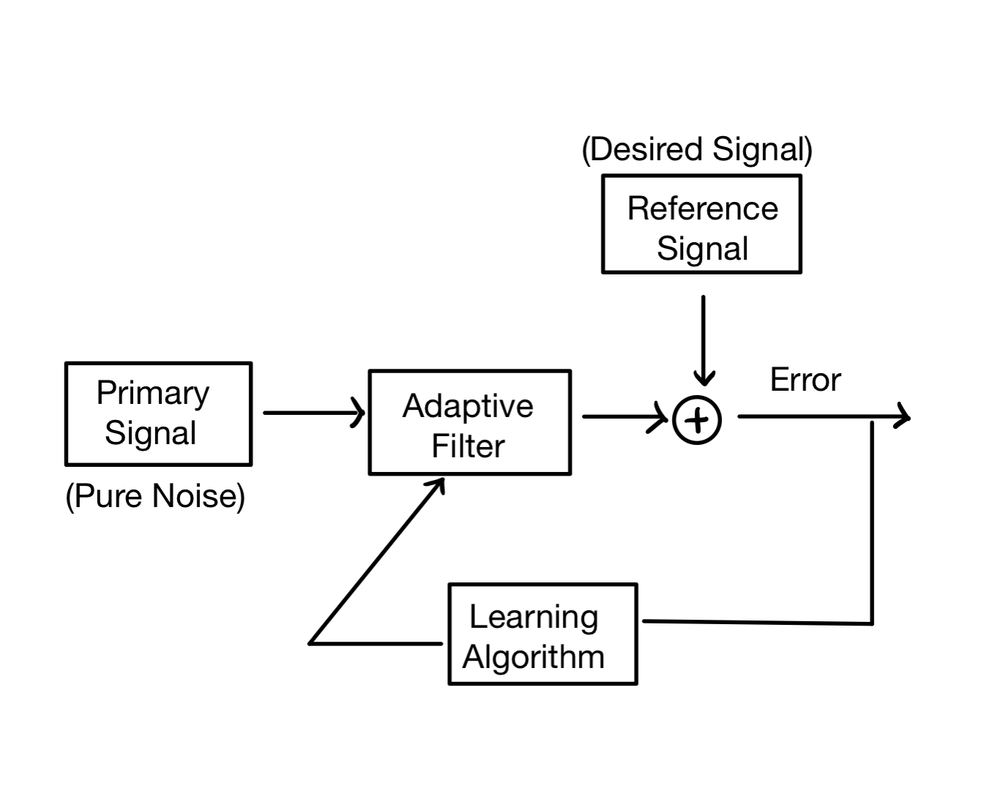

# Noise-Cancellation-Based-On-Adaptive-Filter

## Introduction
The object of the project is to employ NLMS and Newton algorithms to extract a speech signal from the noise.

In the project, speech data is collected by two microphones in a noisy room with vacuum cleaner. One microphone plced on a table that reccords the speech with vacuum cleaner noise. The second microphone is placed next to vacuum cleaner. In this situation, the speech is barely recognizable.

To extract the speech signal from the environment noise, the NLMS and Newton algorithm is used to build the adaptive filter. The block diagram of the system is shown as follow.

The primary signal contains vacuum cleaner noise only. Reference signal contains vacuum cleaner noise and unrecognizable speech.

There are 2 audio files included in the folder. primary.WAV is the primary signal shown in the block diagram, which contains only the vacuum cleaner noise. The reference.WAV contains vacuum cleaner noise and speech signal. The files are included in the project1.mat, which is loaded in the programming.

In the project, the primary signal used as input signal and reference signal used as desired signal.
